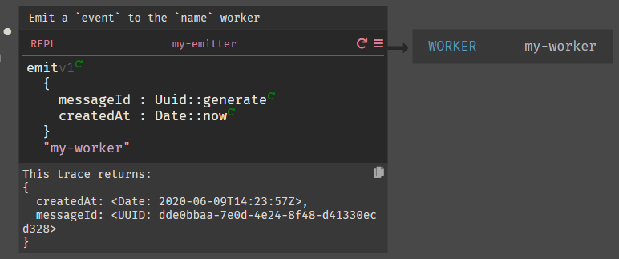

Dark supports doing work asynchronously outside the context of an HTTP handler using a **Worker**. Each worker has a queue of messages, which are processed loosely in-order, executing the code within the Worker once for each message. Messages are created by calling `emit` from any other code, and can contain arbitrary event data.

<iframe width="560" height="315" src="https://www.youtube.com/embed/JpfZIdde_5I" frameborder="0" allow="accelerometer; autoplay; encrypted-media; gyroscope; picture-in-picture" allowfullscreen></iframe>

## Worker Basics

- Workers will automatically process each message. The `event` data passed to `emit` is available in the Worker as a special variable `event`. This can be of any type, but it is often convenient to use a Dict holding many other values.
- Workers process messages roughly in the order that they were received. Generally, older messages are processed first, but strict ordering is not guaranteed.
- A message should be processed within a minute of being emitted. Typically, processing begins within a few seconds.
- If there are multiple items in the queue, a live count of queue items will appear at the top left.
- You can pause the queue by hitting the "pause" button in case of operational issues or if you'd like to stop and debug.
- The last 10 processed events will show as traces that you can use for debugging purposes.
- Workers will not alert you of failures unless you write logic to do so.

## Creating a Worker

Workers can be created from the omnibox or sidebar.

Similar to HTTP handlers, calling `emit` with a nonexistent Worker name will populate that worker in the 404 sidebar section, allowing it to be created.

Creating a Worker from a 404 may result in a delay when executing the first message. When a new worker is created, it immediately processed the first message in the queue, but returns `Incomplete` because no code has been written yet. This causes the message to get automatically retried in 5 minutes, but until then it may look like no messages are being processed.

This is all quite confusing, so for now we recommend creating the Worker and completing its code first, before emitting events to it.

## FAQ

### How do I access the data from `emit` in the worker?

The data from the `emit` is available in a variable called `event` from within the worker. Its type will be whatever was passed to `emit` (eg, `emit [1, 2] “my-worker”` will have `event` = `[1, 2]`

### Do workers execute in parallel?

Yes. Workers across a canvas execute in parallel, and multiple messages for a worker may be processed in parallel.

### Can I control the concurrency of my worker?

No. If multiple messages are enqueued for a worker, the Dark platform may execute them concurrently. We intend to eventually add controls for managing concurrency.

### Can I un-enqueue a message?

No, this is not currently possible. An alternative would be to give each message a unique UUID, then create a datastore of message IDs to ignore, checking it within your worker.

### Do workers guarantee exactly-once delivery?

No. Messages have at-least-once delivery semantics. Adding a unique UUID to every message can be useful in keeping track of which messages have been seen by your worker already.

### How do I wait for a worker to finish?

The code that calls `emit` has no way to know when a worker has completed. If you need a synchronous call, consider a function instead.

### Can I call `emit` from a Worker?

Yes. This can be useful to do fan-out of work or batch processing of data.

In fact, you can `emit` to the same Worker that's processing the message. Just be careful that you don't cause a infinite loop or positive feedback loop. (We are likely to disable your Worker if this happens, as it can cause instability of the entire worker infrastructure right now.)

### How can I tell how long a message was enqueued?

We currently don’t have a way to get this information directly. You can calculate this yourself by adding a timestamp to each message when you call `emit`.

### Why does my worker show pending messages that aren’t being processed?

Your worker is paused and will not process messages while paused. Click the play button at the top left of the worker to resume processing.

Alternatively, you emitted messages to a non-existent Worker and then created it from the 404 section (see the warning above in **Creating a Worker**). Complete the code in the handler and wait up to 5 minutes for the message to be re-processed.

### What happens when a message fails?

Nothing special. A message that causes a worker to throw a runtime error (for example by returning Incomplete or having a function call go to the Error Rail) will be silently ignored and the worker will process the next message. We plan to eventually add more error handling capabilities such as automatic retries and dead-letter-queues.

### How long will it take my worker to execute?

Your Worker executes code the same as any other Dark component. For example, making external HTTP calls will cause execution to take longer.

## Future Improvements

This is a list of improvements we'd like to make to Workers. If you have opinions on how these might work or other ideas, please reach out in the `#general` Slack channel. If you're interested in contributing any of this functionality, get in touch in `#contributors`.

- Error handling: automatic retry, dead-letter queue
- Concurrency control, allowing for tuning how many messages a Worker will process in parallel
- Queue introspection to see more about the messages in the queue
