In this tutorial, we will create a tool that allows you to approve or deny users
who have joined a waitlist, and receive alerts about the waitlist via IFTTT. For
the purposes of this tutorial, we will host everything locally instead of
uploading via static assets.

## Waitlist Functionality

1. Start by making a simple web form to allow users to join your waitlist. All
   of the work for this tutorial can be done locally, but if you're interested
   you can learn more about [uploading static assets here.](../static-assets)

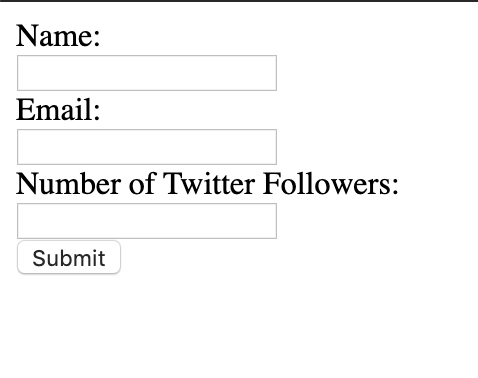

We've used the code below - note that you will need to replace the URL that is
posted to with your own username and canvas.

```HTML
<html>
<form method="post" action="https://username-canvasname.builtwithdark.com/submit">
  <label for="name">Name:</label><br>
  <input type="text" id="name" name="name"><br>
  <label for="email">Email:</label><br>
  <input type="text" id="email" name="email"><br>
  <label for="twitter">Number of Twitter Followers:</label><br>
  <input type="text" id="twitter" name="twitter"><br>
  <input type="submit" value="Submit">
</form>
</html>
```

2. Enter some information on the form and click "submit". You will get a 404
   error.


3. Go to your canvas and check your 404s in the sidebar - a new one should be
   available. Click to add it to your canvas.


4. Once your handler has been added, you can mouse over the trace (white dot on
   the left) to see the data you passed through via the form.


5. We're going to want to add this information to a datastore - create a new one
   via the sidebar and add the following fields.

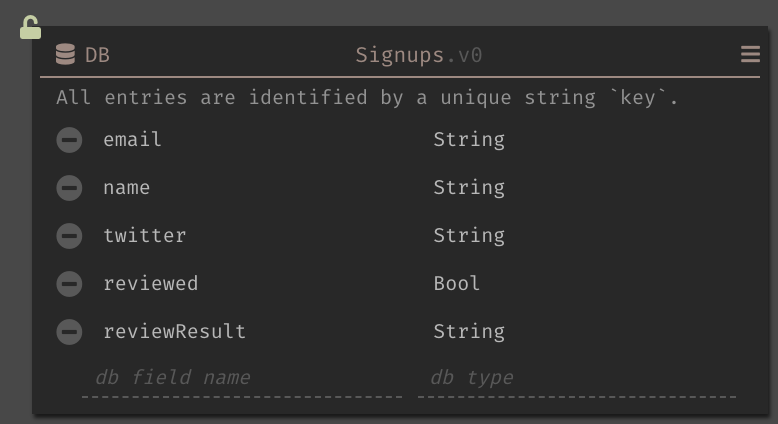

6. Grab the email, name and number of twitter followers from the request.


7. Use a `DB::set` to add the information to your datastore. Note that we've
   also set the `reviewed` and `reviewResult` fields. We will be using these to
   keep track of where waitlist entries are in the process.

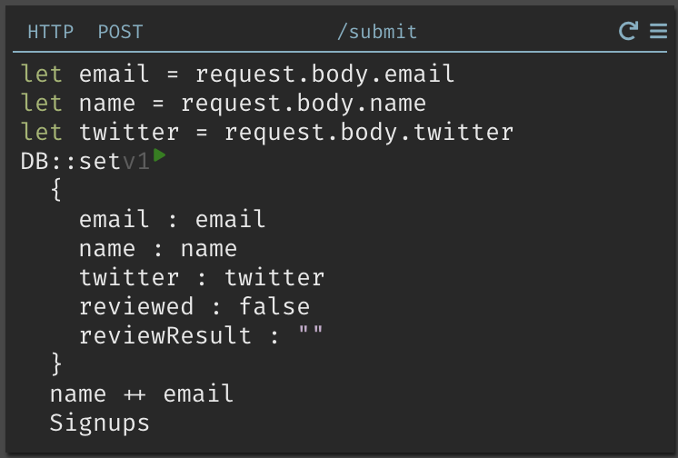

8. Resubmit your form, or use the play button to run your handler. Your
   datastore should update and lock.

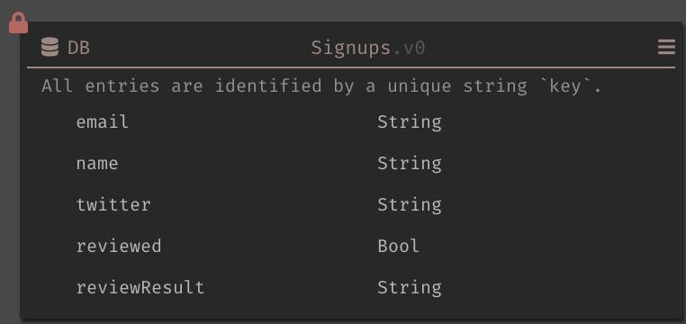

9. We now need to create a few more files to see our waitlist queue. Note that
   you will need to replace the URLs in `script.js` with your username and
   canvas name.

<details><summary>queue.html</summary>

```html
<html lang="en">
  <head>
    <meta charset="utf-8" />
    <meta name="viewport" content="width=device-width, initial-scale=1.0" />

    <title>Unreviewed</title>

    <link
      href="https://fonts.googleapis.com/css?family=Dosis:400,700"
      rel="stylesheet"
    />
    <link href="style.css" rel="stylesheet" />
  </head>

  <body>
    <div id="root"></div>
    <script src="scripts.js"></script>
  </body>
</html>
```

</details>

<details><summary>script.js</summary>

```javascript
const app = document.getElementById("root");

const container = document.createElement("div");
container.setAttribute("class", "container");

app.appendChild(container);

var request = new XMLHttpRequest();
request.open(
  "GET",
  "https://username-canvasname.builtwithdark.com/get-unreviewed",
  true,
);
request.onload = function () {
  // Begin accessing JSON data here
  var data = JSON.parse(this.response);
  if (request.status >= 200 && request.status < 400) {
    data.forEach(entry => {
      const card = document.createElement("div");
      card.setAttribute("class", "card");

      const h1 = document.createElement("h1");
      h1.textContent = entry.name;

      const lineBreak = document.createElement("br");

      const fn = document.createElement("fn");
      entry.email = entry.email;
      fn.textContent = `${entry.email} `;

      const lineBreak2 = document.createElement("br");

      const ln = document.createElement("ln");
      entry.twitter = entry.twitter;
      ln.textContent = `${entry.twitter}`;

      var btn = document.createElement("Button");
      btn.innerHTML = "Approve";
      btn.onclick = function markApproved() {
        var request2 = new XMLHttpRequest();
        request2.open(
          "POST",
          "https://username-canvasname.builtwithdark.com/reviewed",
          true,
        );
        request2.setRequestHeader(
          "Content-type",
          "application/x-www-form-urlencoded",
        );
        request2.send(
          "name=" +
            entry.name +
            "&email=" +
            entry.email +
            "&twitter=" +
            entry.twitter +
            "&result=approved",
        );
        location.reload();
        return false;
      };

      var btn2 = document.createElement("Button");
      btn2.innerHTML = "Reject";
      btn2.onclick = function markRejected() {
        var request2 = new XMLHttpRequest();
        request2.open(
          "POST",
          "https://username-canvasname.builtwithdark.com/reviewed",
          true,
        );
        request2.setRequestHeader(
          "Content-type",
          "application/x-www-form-urlencoded",
        );
        request2.send(
          "name=" +
            entry.name +
            "&email=" +
            entry.email +
            "&twitter=" +
            entry.twitter +
            "&result=rejected",
        );
        location.reload();
        return false;
      };

      container.appendChild(card);
      card.appendChild(h1);
      card.appendChild(fn);
      card.appendChild(lineBreak);
      card.appendChild(ln);
      card.appendChild(lineBreak2);
      card.appendChild(btn);
      card.appendChild(btn2);
    });
  } else {
    const errorMessage = document.createElement("marquee");
    errorMessage.textContent = `Gah, it's not working!`;
    app.appendChild(errorMessage);
  }
};

request.send();
```

</details>

<details><summary>style.css</summary>

```css
#root {
  max-width: 1200px;
  margin: 0 auto;
}

.container {
  display: flex;
  flex-wrap: wrap;
}

.card {
  margin: 1rem;
  border: 1px solid gray;
}

@media screen and (min-width: 600px) {
  .card {
    flex: 1 1 calc(50% - 2rem);
  }
}

@media screen and (min-width: 900px) {
  .card {
    flex: 1 1 calc(33% - 2rem);
  }
}
```

</details>

10. Once you've created the page, visit it to generate another 404. Add your new
    404 to your canvas.


11. Write a `DB::query` to grab all of the entries in `Signups` where reviewed
    is `false`.


12. Refresh your page - the form entry from before will now be visible.


13. Click either the Approve or Reject buttons on your page to get another 404.


14. Check your trace - you should see information from your entry passed
    through.


15. Just like before, grab the information from the request.


16. Do a `DB::set` to update your datastore.


17. Let's make one more page, to take a look at our approvals. Once you've
    created it, visit it to get a 404.

<details><summary>approved.html</summary>
```
<html lang="en">
  <head>
    <meta charset="utf-8" />
    <meta name="viewport" content="width=device-width, initial-scale=1.0" />

    <title>Approved</title>

    <link href="https://fonts.googleapis.com/css?family=Dosis:400,700" rel="stylesheet" />
    <link href="style.css" rel="stylesheet" />

  </head>

  <body>
    <div id="root"></div>
    <script src="approvedscripts.js"></script>
  </body>
</html>
```
</details>

<details><summary>approvedscripts.js</summary>

```
const app = document.getElementById('root')

const container = document.createElement('div')
container.setAttribute('class', 'container')

app.appendChild(container)

var request = new XMLHttpRequest()
request.open('GET', 'https://victoria-waitlistalerts.builtwithdark.com/get-approved', true)
request.onload = function() {
  // Begin accessing JSON data here
  var data = JSON.parse(this.response)
  if (request.status >= 200 && request.status < 400) {
    data.forEach(entry => {
      const card = document.createElement('div')
      card.setAttribute('class', 'card')

      const h1 = document.createElement('h1')
      h1.textContent = entry.name

      const lineBreak = document.createElement('br');

      const h2 = document.createElement('fn')
      entry.email = entry.email
      h2.textContent = `${entry.email}` + `\n`

      const lineBreak2 = document.createElement('br');

      const ln = document.createElement('ln')
      entry.twitter = entry.twitter
      ln.textContent = `${entry.twitter}`

      container.appendChild(card)
      card.appendChild(h1)
      card.appendChild(lineBreak2)
      card.appendChild(h2)
      card.appendChild(lineBreak)
      card.appendChild(ln)


    })
  } else {
    const errorMessage = document.createElement('marquee')
    errorMessage.textContent = `Gah, it's not working!`
    app.appendChild(errorMessage)
  }
}

request.send()
```

</details>


18. Do another `DB::query`, but this time, check that `reviewResult` is
    approved.


19. Visit the page again to see your approvals.


## Creating Alerts

We're going to create two alerts - one that will let you know if you have a
backlog of waitlist entries waiting to be approved, and another that will let
you know if you've gotten a waitlist entry with lots of Twitter followers.

1. Go to IFTTT and chose **Create**. Start by selecting Webhooks or the Maker
   service.

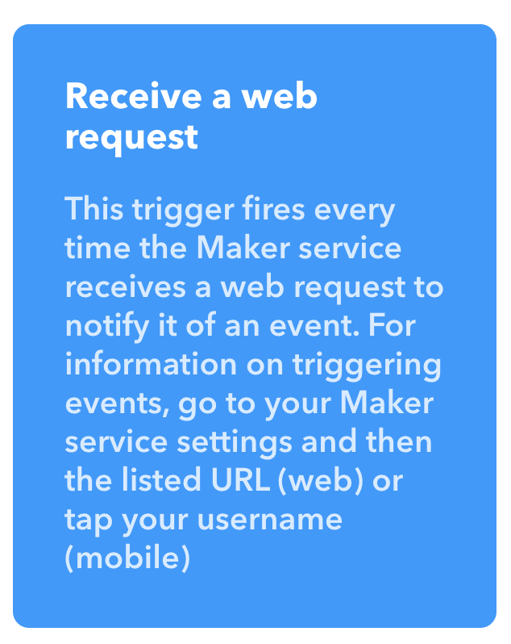

2. Name your event and create the trigger.

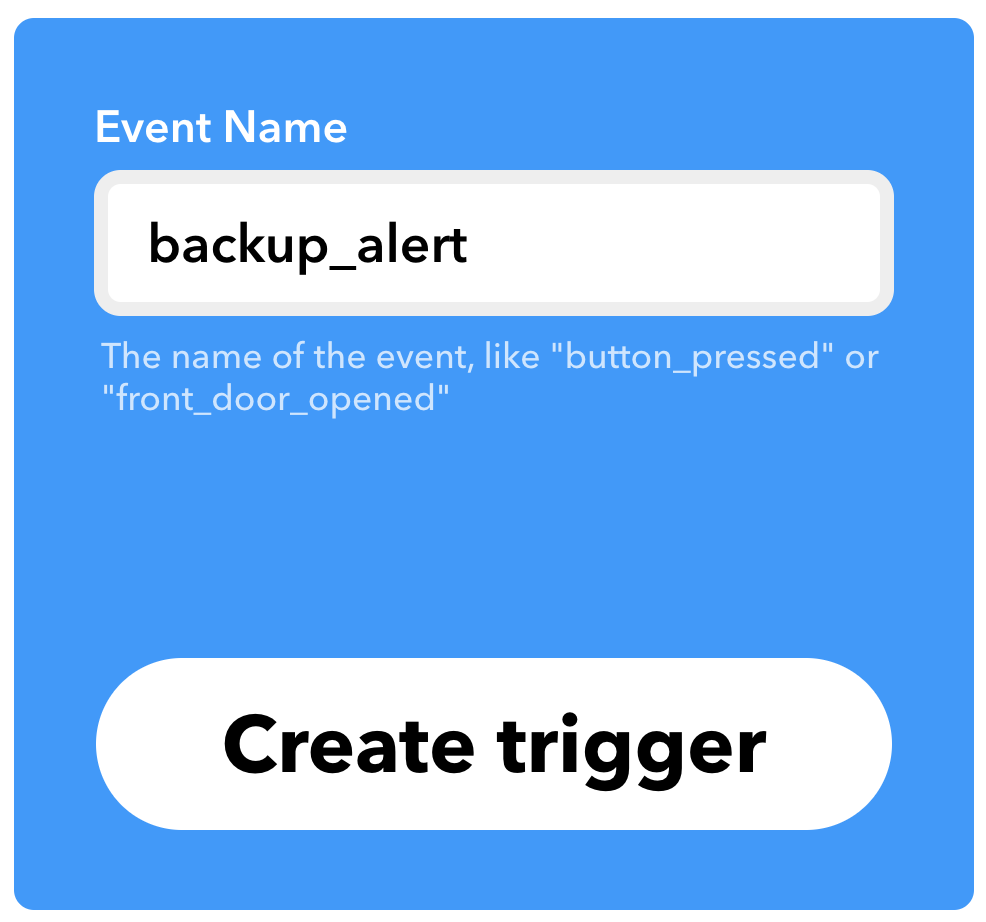

3. Choose "Send me an email" as the result of the trigger.


4. Format the email you will receive. In our case, we want to modify the subject
   line and pass through the value of how many unreviewed entries we have.

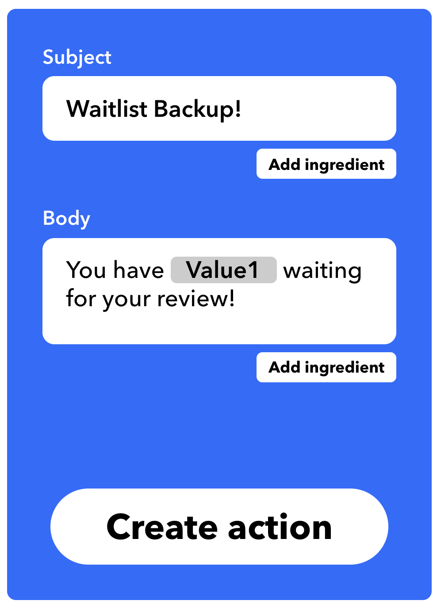

5. Return to your canvas and create a function that keeps track of how many
   unreviewed entries you have.


6. Next, create an hourly Cron that checks if your unreviewed count is too high
   (in this case, we're going to set it to 3) and sends you an email if it is.


7. Add more entries to your waitlist and then click the play button to run your
   cron. You should see an email in your inbox.


Let's make another kind of alert - one that fires as soon as something happens.
In this case, when someone with a lot of Twitter followers joins your waitlist.

1. Create another event in IFTTT and give it a different name.

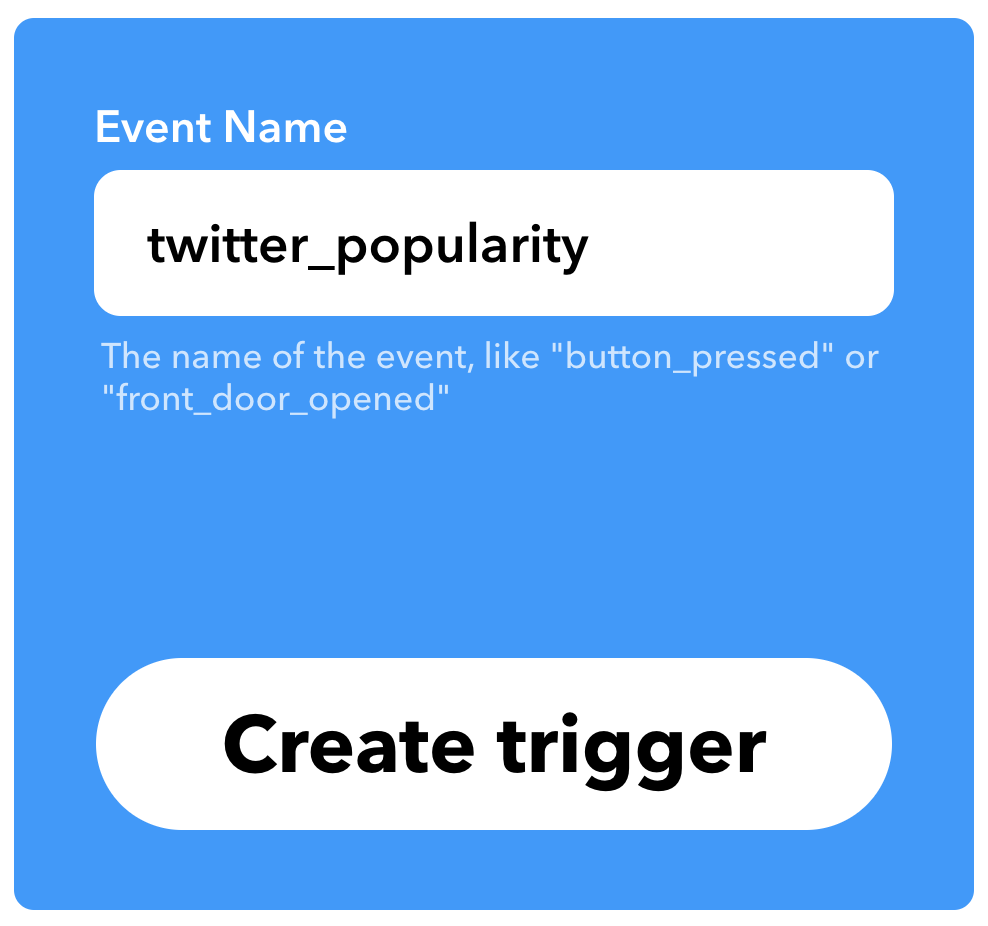

2. Format your email.

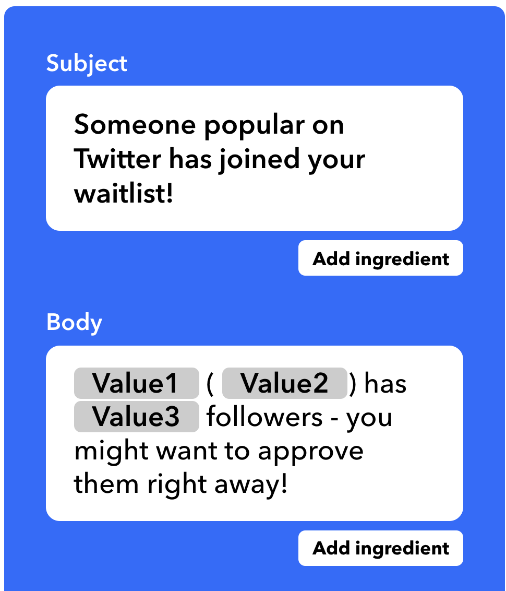

3. In your `/submit` handler, add some logic to check if someone's follower
   count is over 5000 and fire an alert if it is.

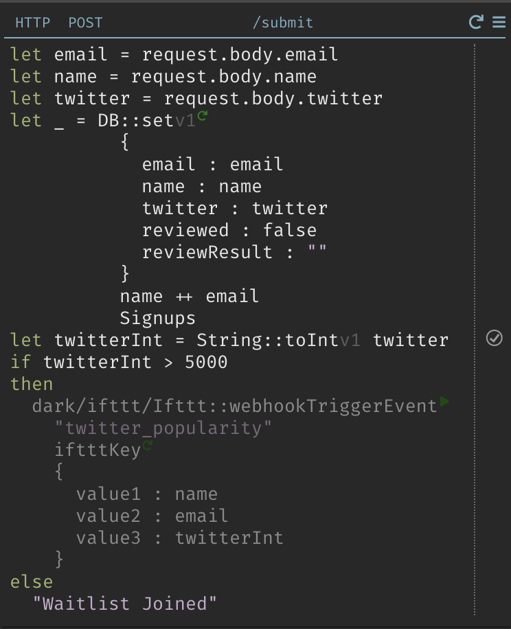

4. Submit an entry to your waitlist with over 5000 followers.

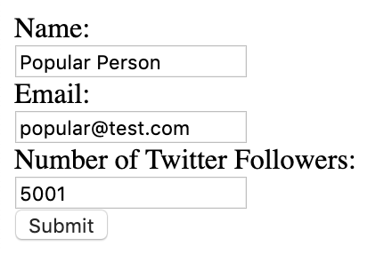

5. Check your email - you should have an alert.


Congratulations, you now have a waitlist you can review, and multiple alerts to
let you know when something important happens.

Some code for this tutorial was written with the help of
[Tania Rascia's How to Connect to an API with Javascript](https://www.taniarascia.com/how-to-connect-to-an-api-with-javascript/) -
thank you!
