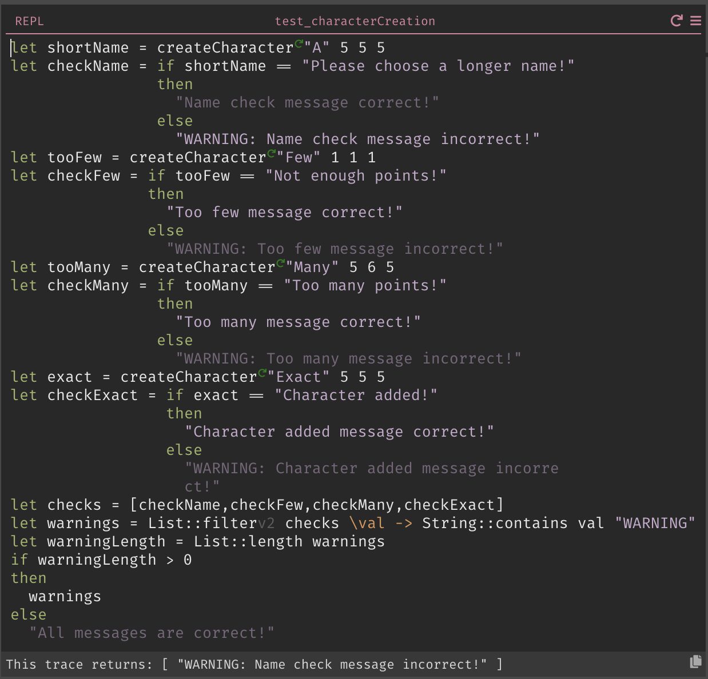

At the moment, Dark does not provide an out of the box testing framework. However, it's fairly straightforward to write tests using REPLs and Crons.

Let's take a simple example: a character creation process where the creator enters the name of their character and allocates 15 skill points into three possible skills. There are a few constraints:

- The name of the character must be more than 2 characters
- All 15 skill points must be used, no more and no less.

Let's say we want to write tests to make sure the proper messages are being printed out. All we need to do is create a REPL and call functions that hit all of these cases:

Now, at a glance, we can see that the messages being printed out look the way we expect them to.

We can even get fancy, and write logic to check that the printed messages say exactly what we want them to without having to read every message. In this example, a portion of the message that gets printed when the name is not long enough has been accidentally deleted, so a warning is displayed.

In the examples above, the tests would need to be run by running the REPL manually. However, the same logic can be written in a cron to make sure the tests run at whatever interval you'd prefer.

If you're worried about missing a failing test, you can always set up alerts to let you know. This is an example of a cron that runs once an hour and posts a message to Slack if an incorrect message is found:

